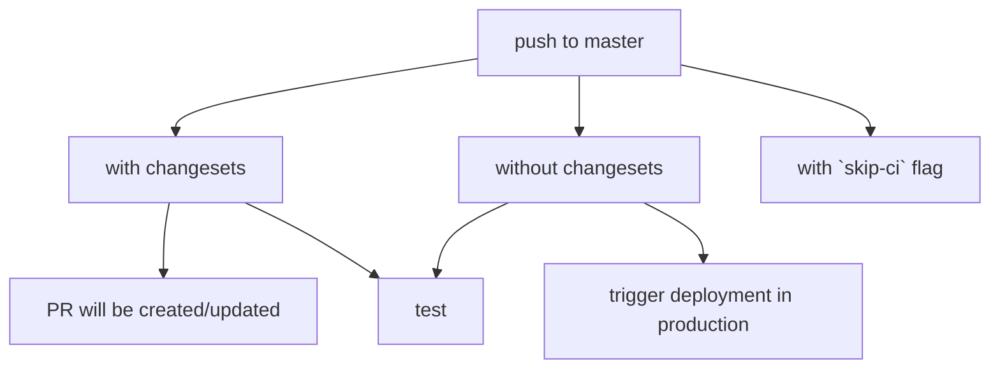

This repository is a mono-repo containing multiple packages located in the `packages` directory. Maintained using [pnpm](https://pnpm.io/) and [turborepo](https://turborepo.org/).

`site`: Main site built with [sveltekit](https://kit.svelte.dev/) & `typescript`. Uses [playwright](https://playwright.dev/) for testing.

`backend`: Server built with [nest](https://github.com/nestjs/nest) & `typescript`.

`docs`: Documentation for site. Built using [kit-docs](https://github.com/svelteness/kit-docs).

`seed`: Helpers for generating realistic fake data to use for development/testing.

`utils`: Contains code to trigger [`/notify-all`](packages/site/src/routes/transactions/notify-all.ts) webhook to send payment reminders to tenants. Hosted on [render](https://render.com/).

`scripts`: Utility scripts for ci/cd.

## Develop:

> In the root directory, run `pnpm install`, then:

### Dev 🛠️

```bash
pnpm dev
# runs site on port 3000, and backend on port 3002.

pnpm outdated --long -r # view outdated deps
pnpm update -iLr # interactively update deps
```

Take a look [.env.example](.env.example) to know what env vars are required.

### Test 🧪

```bash
# local
pnpm run preview
# or pnpm run preview:tunnel (set correct .env if tunnel)
# NOTE: preview mode requires passing in env vars through command line in sveltekit until further notice
pt
pt -- --project "chromium"

# docker - using the included convenience bash script
cd packages/site/tests && ./run-docker-test.sh
```

Requires [.env.test](packages/site/.env.test.example) for the db connection string. Will delete and set up the db on each run.

### Build 📦

```bash
pnpm build
```

### Update 📦

```bash
# create a changeset file
npx changset

# consume changest file, update versions in package.json + update CHANGELOG.md
npx changest version

# publish changed packages to npm (not used)
# npx changest publish

```

## Deploy:

Site and docs are deployed on vercel as sepereate projects.

Settings:

> Site (vercel):

```bash
# build
pnpm build && pnpm run postbuild:vercel
# install
pnpm install --filter=@self/site
```

> /notify-all cron job (render.com):

```bash
# schedule
0 6 1,3,7,14 * *
# build
cd packages/utils && npm install && npm run build
# run
cd packages/utils && npm run start
```

#

To skip deployment on pushed to `master`:

- include `[skip ci]` flag in the commit message
  - good for adding docs, comments in code, etc
  - This will not:
    - open a PR
    - run tests
- add a changeset. This will cause a PR to be opened. When that PR is closed, app will be deployed.


